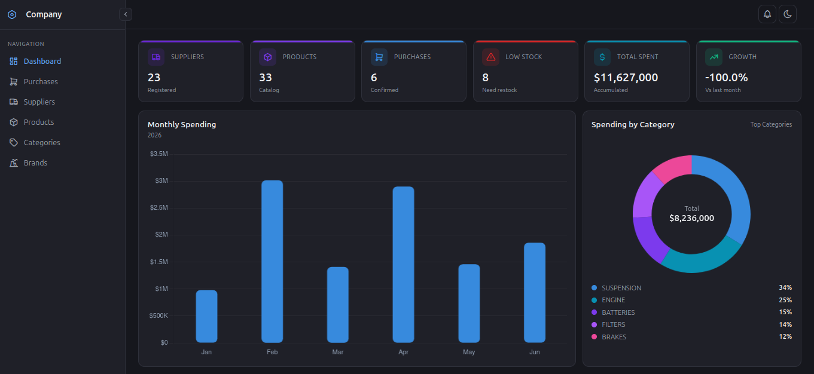
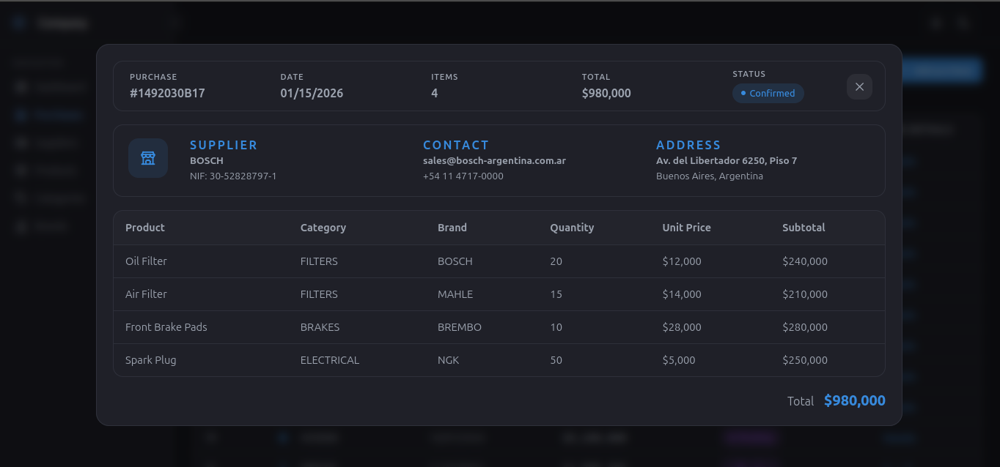

# AutoParts Frontend

Interfaz de usuario desarrollada para el sistema de gestión de inventario y compras de AutoParts. Consume el backend FastAPI y proporciona paneles de control, gestión de productos, gestión de proveedores, seguimiento de compras y monitorización de existencias.

## ¿Por qué Vue?

- **Componentes de archivo único (SFC)**: cada `.vue` junta HTML, CSS y JavaScript/TypeScript en un solo archivo, con secciones bien separadas (`<template>`, `<script>`, `<style>`). Esto evita saltar entre archivos distintos para tocar una misma pantalla y mantiene la lógica, el markup y los estilos de cada vista o modal juntos y fáciles de encontrar.
- **Estilos con scope automático**: usando `<style scoped>` los CSS de un componente no se filtran a otros, lo que evita los choques de clases que suelen pasar cuando se mezcla CSS global en proyectos grandes.
- **Curva de aprendizaje suave**: la sintaxis de templates se parece mucho a HTML plano, lo que hace que sea rápido de leer y mantener incluso para quien no escribió el componente originalmente.
- **Reactividad simple**: los datos se actualizan en pantalla automáticamente cuando cambian, sin manipular el DOM a mano, ideal para tablas y dashboards que se refrescan con datos del backend.

## ¿Por qué Vue para gráficos?

- **Buena integración con librerías de charts**: Vue tiene wrappers maduros para las librerías más usadas —**Chart.js** (`vue-chartjs`), **ApexCharts** (`vue3-apexcharts`) y **ECharts** (`vue-echarts`)— que permiten pasar los datos como props reactivas y que el gráfico se redibuje solo cuando cambian.
- **Composición de dashboards**: al ser componentes como cualquier otro, un gráfico se puede reutilizar en distintas vistas (dashboard general, detalle de un proveedor, reporte de compras) simplemente pasándole distintos datos por props.
- **Rendimiento**: la reactividad fina de Vue evita recalcular o re-renderizar gráficos completos cuando solo cambia una parte de los datos, algo importante cuando el dashboard combina varios charts a la vez (compras por proveedor, distribución por categoría, evolución de precios).

## Otras ventajas del stack

- **TypeScript**: tipa los datos que vienen del backend (productos, proveedores, compras), evitando errores al armar los gráficos y las tablas.
- **Vite**: arranque y recarga en caliente casi instantáneos, útil al ajustar detalles visuales de dashboards y modales.
- **Axios**: centraliza las llamadas a la API del backend y el manejo de errores en un solo lugar.

## Captura de pantalla

